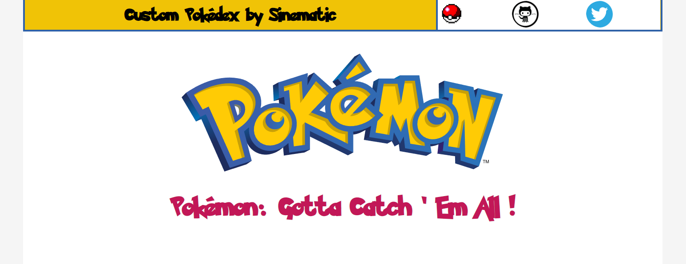
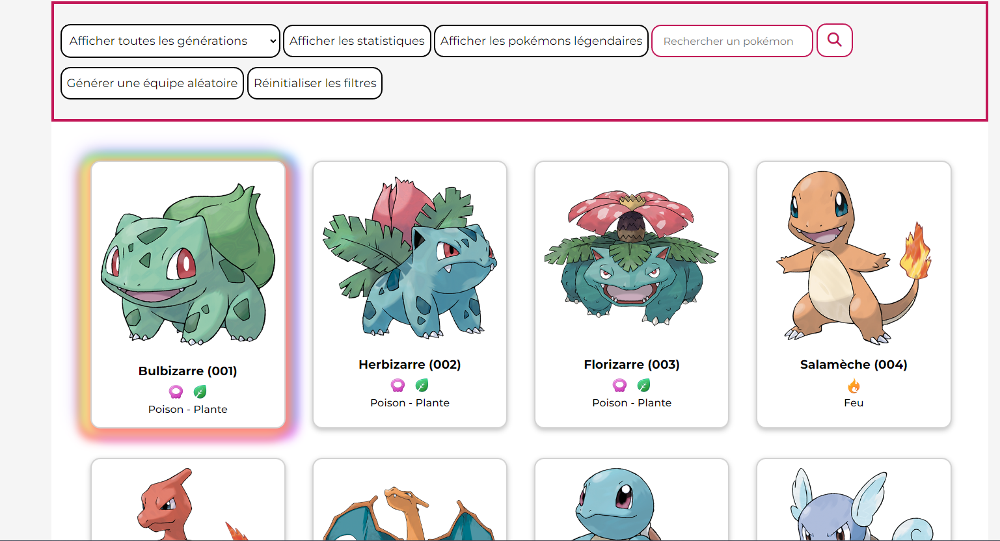
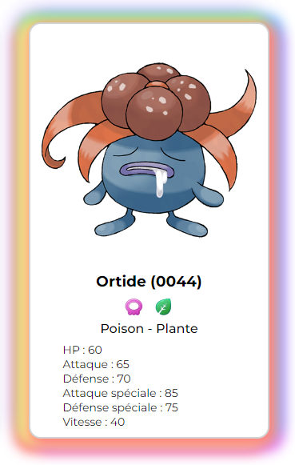
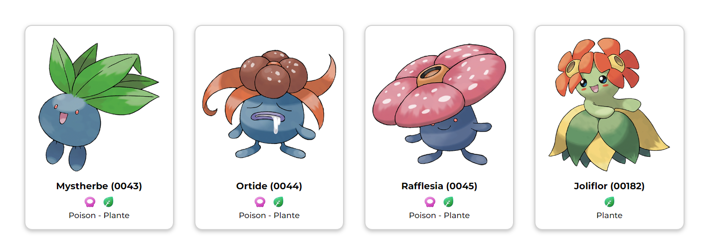

# Custom Pokédex

Le code est modeste mais *ça fonctionne* !

Voici mon premier Pokédex ET surtout ... mon premier projet dynamique en JS ! C'est donc une Single Page Application.

Je me suis servi de l'API Pokebuild (https://pokebuildapi.fr/api/v1) qui propose beaucoup de données sur les Pokémons. J'ai récupéré une box-shadow sur internet très travaillée, tout le reste est fait à la main !  

Mais trêve de bavardages, regardons ce qu'il y a à voir !

**Voici donc à quoi ressemble l'inté de la v1.0 !**

Plus bas se trouvent différents boutons qui permettent de filtrer les pokémons selon différents critères !

- On peut cliquer chaque carte Pokémon
- Afficher ou cacher les statistiques

- Cliquer un pokémon affichera ses pré-évolutions et évolutions 

